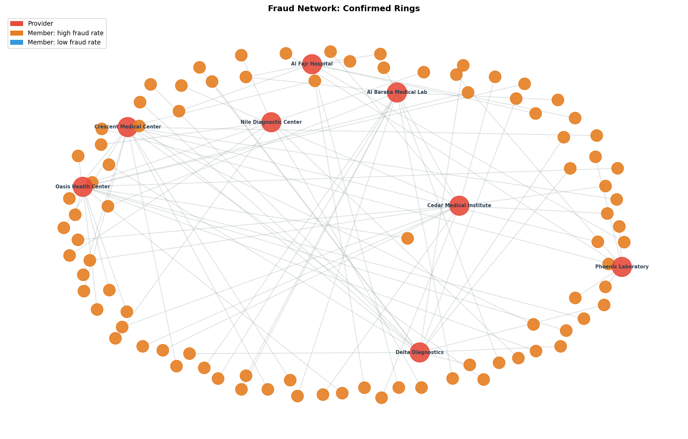
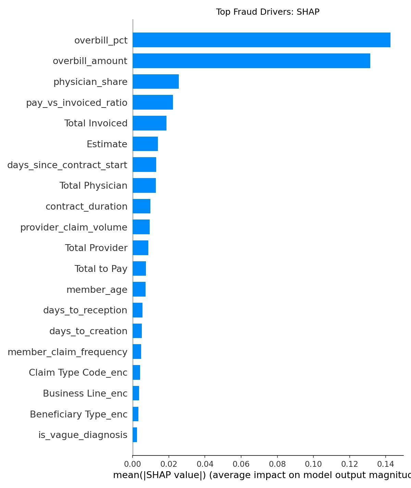
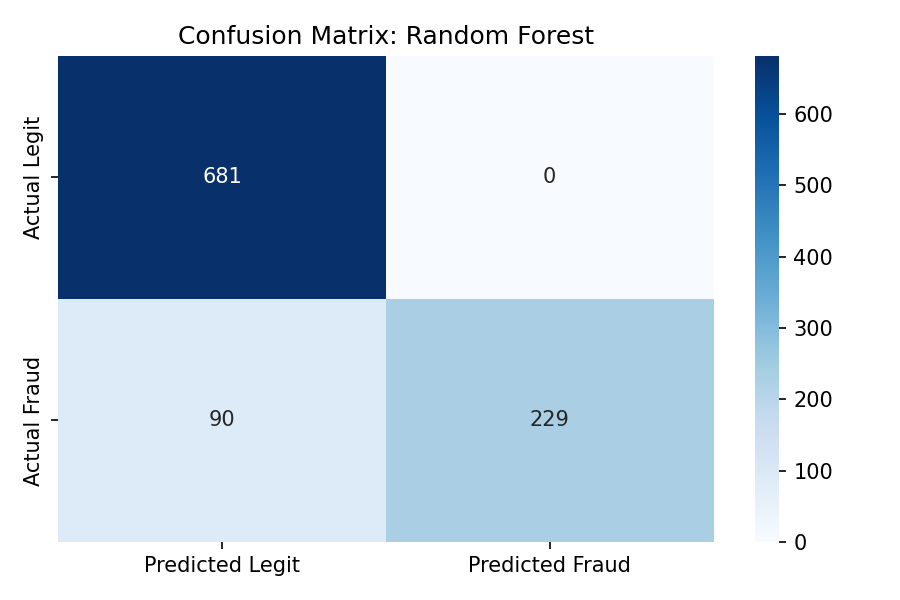
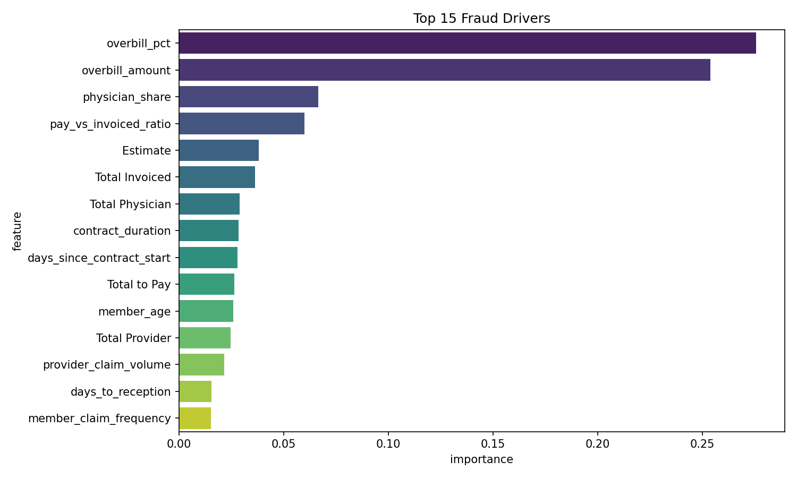

# Medical Insurance Fraud Detection System

An end-to-end fraud detection pipeline built on real medical insurance claims data from a Lebanese insurer. The system combines rule-based detection, machine learning, and network graph analysis to identify fraudulent claims and prioritize investigations.

> **Note:** This repository uses a synthetic dataset of 5,000 claims for demonstration purposes. The original analysis was conducted on 137,819 real proprietary claims (2023-2026) and cannot be shared publicly due to confidentiality agreements.

---

## Real Dataset Results (137,819 Claims)

| Metric | Value |
|---|---|
| Total claims analyzed | 137,819 |
| Fraud rate detected | 21.4% |
| Total fraud flagged | 29,562 claims |
| Investigation queue | 27,138 prioritized claims |
| Estimated recoverable savings | $2.3M |
| Model AUC | 0.998 |
| Fraud recall | 95% |
| Confirmed fraud ring providers | 30 |
| Members with 100% fraud rate | 147 |

---

## Three-Layer Detection Architecture

### Layer 1 - Rule-Based Detection

Six fraud typologies defined and operationalized:

- **Overbilling** - Provider invoiced significantly above pre-approved estimate (21,731 cases)
- **Duplicate Claims** - Identical claim submitted multiple times (6,251 cases)
- **Unbundling** - Single service split into multiple billable components (3,156 cases)
- **Phantom Billing** - Invoiced but not paid and not rejected (2,487 cases)
- **Audit Flagged** - Claims internally flagged by the insurer (2,623 cases)
- **Same-Day Clustering** - Member visiting multiple providers on the same date

### Layer 2 - Machine Learning (Random Forest)

- Trained on engineered features including overbill ratios, claim frequency, provider volume, and billing patterns
- Top fraud drivers: overbill amount, overbill percentage, same-day claim count
- SHAP explainability layer provides per-claim reasoning for investigators
- AUC: 0.998 | Recall: 95% | False positive rate: less than 0.3%

### Layer 3 - Network Graph Analysis

- Built a bipartite graph of member-provider relationships
- Identified clusters of high-fraud-rate members connected to the same providers
- Calculated betweenness centrality to find central fraud ring coordinators
- Confirmed fraud rings across 30 providers with 147 members showing 100% fraud rates

---

## Visuals

### Fraud Network - Confirmed Rings

### Top Fraud Drivers - SHAP

### Model Performance - Confusion Matrix

### Feature Importance

---

## Composite Fraud Score

Each flagged claim receives a weighted composite score (0-100) combining:

| Component | Weight |
|---|---|
| Provider peer deviation | 35% |
| Member fraud history | 25% |
| Diagnosis risk patterns | 15% |
| Claim-level rule flags | 15% |
| Network centrality | 10% |

---

## Power BI Dashboard (6 Pages)

The full interactive dashboard is included as `Medical Claims Fraud Detection Dashboard.pbix`

1. **Executive Summary** - KPIs, risk tier distribution, monthly fraud trend
2. **Provider Intelligence** - Highest risk providers, peer benchmarking, fraud ring providers
3. **Member & Claim Analysis** - Member-level fraud patterns
4. **Investigation Queue** - Prioritized claims with composite scores and estimated savings
5. **Portfolio Overview** - Active member trends, claims volume 2023-2026
6. **Dashboard Filters** - Interactive slicers by risk tier, year, business line, provider specialty, agency

---

## Repository Contents

| File | Description |
|---|---|
| `Fraud_Detection_Pipeline_Public.ipynb` | Full Python analysis notebook |
| `Fraud_Detection_Report_Public.docx` | 11-page technical and business report |
| `Medical Claims Fraud Detection Dashboard.pbix` | Interactive Power BI dashboard |
| `synthetic_claims_data.csv` | Synthetic demo dataset (5,000 claims) |
| `synthetic_production_data.csv` | Synthetic production/portfolio data |
| `claims_fraud_scored_final.csv` | Full scored output with all features |
| `investigation_queue_final.csv` | Prioritized investigation queue |
| `active_members_monthly_detailed.csv` | Active members by month and business line |
| `confusion_matrix.png` | Model evaluation visualization |
| `shap_importance.png` | SHAP feature importance |
| `feature_importance.png` | Random Forest feature importance |
| `fraud_network.png` | Fraud ring network visualization |

---

## Tech Stack

- **Python** - pandas, numpy, scikit-learn, SHAP, NetworkX, matplotlib, seaborn
- **Power BI** - 6-page interactive dashboard
- **Machine Learning** - Random Forest Classifier
- **Graph Analysis** - NetworkX (betweenness centrality, bipartite graph)
- **Explainability** - SHAP values

---

## Limitations and Future Enhancements

- Procedure/CPT codes would enable more precise unbundling detection
- Member-to-contract mapping would strengthen member-level risk profiling
- Pharmacy data would enable pharmacy fraud network analysis
- Premium data would enable actuarial pricing impact quantification

---

## Author

**Marie-Christine Btaich**  
Actuarial Science Graduate - Notre Dame University Louaize  
Currently pursuing SOA Exam P | Actuarial and Insurance Analytics

